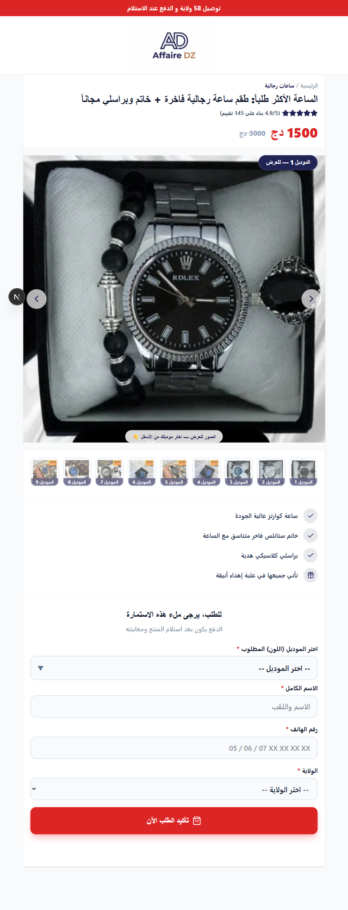

# afairdz - Algerian Fair Platform

Multi-tenant Next.js 16 platform for Algerian stores and landing pages with Arabic RTL support.

## 📸 Screenshots

### Home Page


## 🚀 Quick Start

```bash
npm install
npm run dev
```

Open [http://localhost:3000](http://localhost:3000)

## 🛠 Tech Stack

- **Framework**: Next.js 16 (App Router)
- **Styling**: Tailwind CSS
- **Language**: TypeScript
- **Database**: JSON files (data/)
- **Deployment**: Vercel

## 📁 Project Structure

```
src/
├── app/           # App Router pages
├── components/    # React components
└── lib/           # Utilities
data/              # JSON data files
```

## 🔧 Environment

Copy `.env.example` to `.env.local` and configure.

## 📦 Build

```bash
npm run build
npm start
```